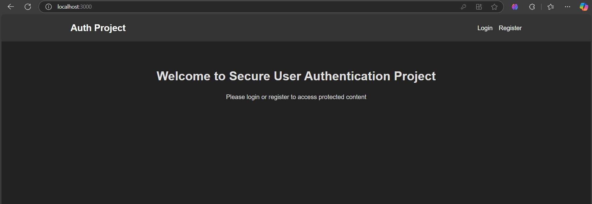
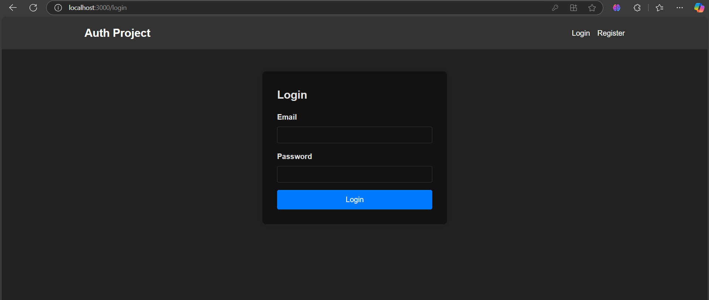
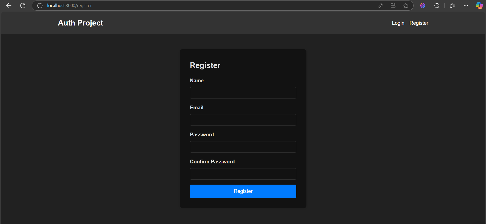
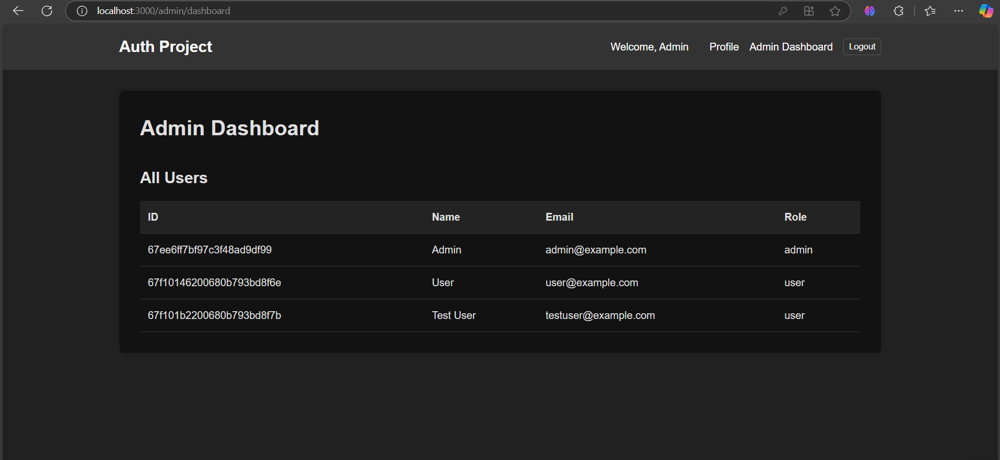
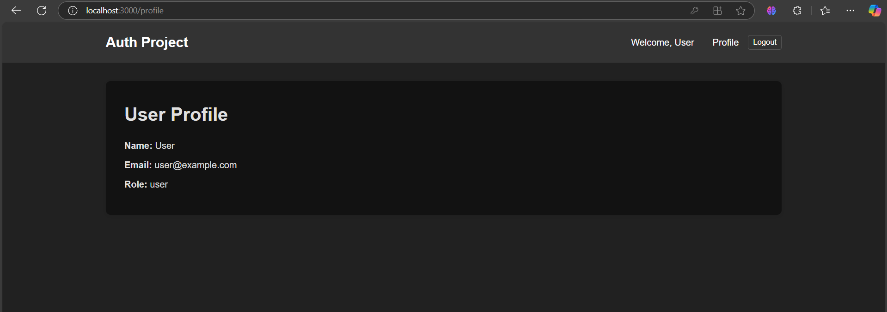

# 🔐 Secure User Authentication

A beginner-level full-stack web application for **secure user authentication** built with the **MERN stack**: **MongoDB, Express.js, React, Node.js**. It supports user signup, login, and protected routes using JWT-based authentication.

---

## 🚀 Features

- User registration and login forms (React)
- Password encryption using **bcrypt** for secure storage
- JWT (JSON Web Token) for access token generation
- Role-based access control (can be extended for admin/user roles)
- Protected API routes on the backend
- Protected frontend pages using JWT validation
- Persistent authentication using localStorage
- Clear error messages and input validations

---

## 🛠️ Tech Stack

| Layer     | Technology           |
|-----------|----------------------|
| Frontend  | React.js, Axios      |
| Backend   | Node.js, Express.js  |
| Database  | MongoDB (Mongoose)   |
| Auth      | JWT, bcrypt          |
| Tools     | Postman, dotenv      |

---

## 📂 Project Structure

```bash
Secure-User-Authentication/
│
├── frontend/                   # React frontend
│   ├── public/
│   └── src/
│       ├── components/         # Reusable UI components
│       ├── pages/              # Signup, Login, Dashboard pages
│       ├── services/           # Axios API calls
│       ├── App.js              # Main React component
│       └── index.js            # Entry point of React app
│
├── backend/                    # Node + Express backend
│   ├── config/                 # MongoDB connection setup
│   ├── controllers/            # Logic for signup/login
│   ├── middleware/             # JWT auth middleware
│   ├── models/                 # User schema (Mongoose)
│   ├── routes/                 # API route handlers
│   ├── .env                    # Environment variables
│   ├── .gitignore              # Ignored files
│   ├── server.js               # Backend entry point
│   └── package.json            # Backend metadata
│
└── README.md                   # Project documentation
```

---

## 📦 Getting Started

### 🔧 Backend

Create a .env file with

```bash
// backend/.env
PORT=5000
MONGO_URI=your_mongodb_connection_string
JWT_SECRET=your_jwt_secret
```

Start backend

```bash
cd backend
npm install
npm run dev
```

### 🌐 Frontend

```bash
cd client
npm install
npm start
```

---

## 🖼️ Screenshots

**Home Page**


**Login Page**


**Register page**


**Admin Dashboard**


**User Profile**


---

## 🙌 Acknowledgements

Special thanks to the creators and maintainers of:

- [Express.js](https://expressjs.com/)
- [React](https://reactjs.org/)
- [MongoDB](https://www.mongodb.com/)
- [JWT](https://jwt.io/)
- [bcrypt](https://github.com/kelektiv/node.bcrypt.js)
- [ChatGPT](https://openai.com/chatgpt) – For guidance, debugging, and support throughout development.

---

## 📚 Learning Purpose

This project was built to strengthen my understanding of:

- 🔐 User authentication with JWT
- 🔄 Frontend-backend communication using Axios
- 🧠 Managing secure user sessions
- 📦 Working with environment variables
- 🧩 Structuring full-stack applications using the MERN stack

It serves as a strong foundation for building secure and scalable web applications.

---

## 🙌 Author

👤 **Mylapalli Yesebu**  
📧 [yesebumylapalli08@gmail.com](mailto:yesebumylapalli08@gmail.com)  
🌐 [GitHub Profile](https://github.com/MylapalliYesebu)

If you liked this project, feel free to connect or star the repo ⭐
